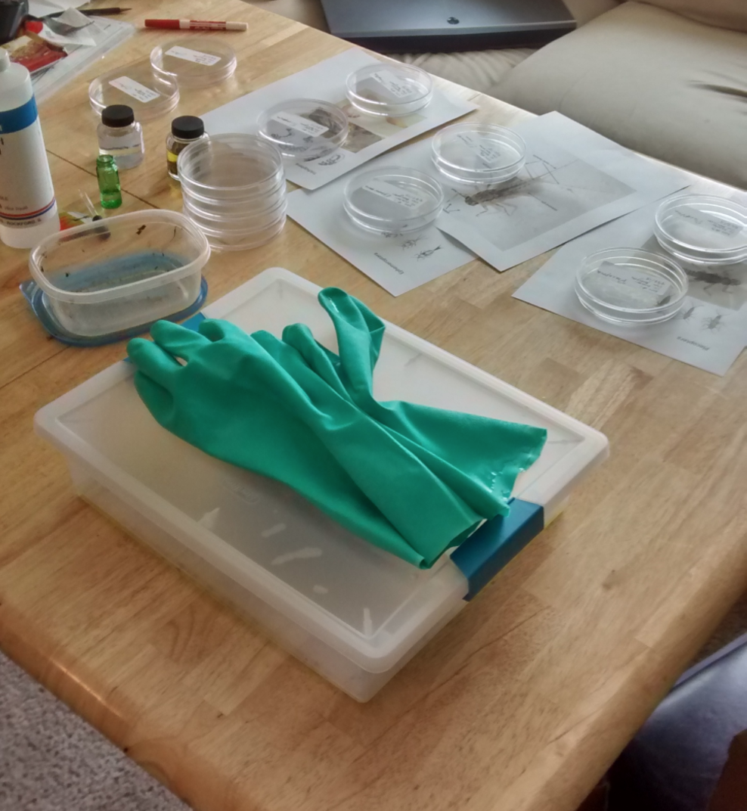
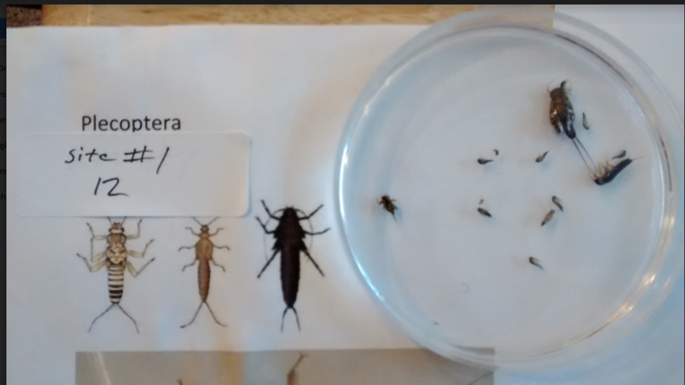

# Benthic Macroinvertebrate Identification

The Cean Water Act requires each state to monitor their rivers, streams, and other water resources for both point sources and non-point sources of pollution. This requirement makes for a unique challenge, since this monitoring has the potential to be both expensive and time consuming.

An alternative to chemical testing is the use of bioassessment. This is a method that uses existing aquatic organisms as a measure of the health of the system. Of the organisms used for this process, benthic macroinvertebrates are the most useful due to their ease of collection and identification, sensitivity to environmental change, and the wide variety of different taxa represented in the group. 

    

With biological assessment, we can utilize existing stream biota to gauge the health of a stream. This offers a number of advantages over traditional methods of water quality assessment. In the framework of the Clean Water Act, it makes the water assessments more accessible and meaningful. The biological integrity of a stream system is easier to understand than the stream’s chemical makeup. Furthermore, the stream ecosystem is a more integrated metric of total watershed health. Stream biota will respond to physical stresses, such as perturbations in temperature, stream flow, mixing, or habitat variety, as well as chemical or biological stresses. Aquatic communities integrate the conditions of a watershed, from the tributaries through the main stream (Barbour, 1999).

There are some species of benthic macroinvertebrates that are very good indicators of pollution levels. If the organism is relatively large and does not develop a respiratory system, then it will require a constant flow of well oxygenated water in order to survive. This includes certain Trichoptera and Plecoptera larvae which lack gills. As pollution tends to lead to decreased dissolved oxygen content (DOC), this means that these groups are likely to see population decreases first as DOC falls. Conversely, there are groups that have adaptations to low oxygen environments. This includes certain Chironomidae, Notonectidae, and Oligochaeta which have a respiratory pigment which increases the efficiency of oxygen absorption (Alba-Tercedor, 2006). As DOC falls, we would expect to see the relative proportion of these organisms increase.  

# Biologic Metrics  

A biological metric is a way of quantifying the results of a biological survey of a stream.  They attempt to quantify the integrity of the biological community, ideally taking into account the taxonomic structure and function in such a way as to indicate ambient water quality.  This has been used as a means of measuring water quality since Kolwitz and Marsson authored a paper quantifying the relationship between aquatic organisms and the purity or pollution of water in 1902. The method they outlined, the saprobic approach, involved observing particular pollution sensitive organisms and noting their responses, and it is still in limited use today.  One such metric is biological diversity. This incorporates three different components of community structure: richness, evenness, and abundance. Richness is the number of species present, evenness is a measure of how uniformly the individuals are distributed among species, and abundance is the total number of organisms present. The most common diversity index is the Shannon-Wiener index:

  

Where H’ is the diversity index value, Ni is the number of individuals belonging to species i, and N is the total number of specimen collected (Metcalfe-Smith, 1994). This has the advantages of being a strictly quantitative number, which lends itself to statistical representation, and no assumptions are made about the relative tolerances of individual species – such tolerances being sometimes questionable, and capable of variation among regions.

# CNNs to Identify Benthic Macroinvertebrates

  
 Plecoptera collected from the Boulder Creek   

To calculate a metric such as the Shannon-Wiener Index, we need to identify which benthic macroinvertebrates we've collected. That is easier said than done, however, as it requires a trained eye to pick out the details that distinguish them. It's time consuming to identify each specimen, and for someone with very little experience such as myself, it's difficult to resolve taxonomic detail at a level much deeper than order.  

A tool that could identify benthic macroinvertebrates from images could save time and allow amateurs to participate more readily in the stewardship of our waterways. To this end, I intend to:

1. Collect, label, and preprocess images of benthic macroinvertebrates I collected from the Boulder Creek, as well as images scrapped from the web.
  - Find at least 30 additional images per day
  - Label each image with as much taxonomic depth as is available
      - this can be automated for some image sets (troutnet images, my webscraper collected metadata including taxonomy)
      - Directory: file name: Order: Family: Genus: Species
  - Preprocessing:
      - These are coming from different sources, which might be a problem. If one website is weighted heavily towards  ephemeroptera (troutnet), I don't want my CNN to pick up on watermarks/characteristic style as a factor. 
      - Image processing pipeline that includes:
          - trimming images
          - scale to same resolution
          - etc.
2. Some image sets (the troutnet image set, for example) have a lot of images that I can't use. 
    - cull unuseable images
        - close ups
        - duplicates
        - etc.
3. Move processed images to S3 instance
    - I will probably need to use AWS to train my CNN
4. Take weights from a pre-trained model and load them into a convolutional neural network (this will save training time)
5. Train a CNN to identify the images down to as fine a taxonomic resolution as is possible in the time I have.

Alba-Tercedor, J. “Aquatic Macroinvertebrates.” Biological Monitoring of Rivers: Applications and Perspectives. John Wiley and Sons, Ltd., West Sussex, pp. 71-87. (2006).

Barbour, M., Gerritsen, J., Snyder, B., et al. Rapid Bioassessment Protocols for Use in Streams and Wadable Rivers: Periphyton, Benthic Macroinvertebrates and Fish, Second Edition. US Environmental Protection Agency. (1999). 

Metcalfe-Smith, J. L. “Biological Water-Quality Assessment of Rivers: Use of Macroinvertebrate Communities.” The Rivers Handbook: Hydrologic and Ecological Principles, Volume II. Blackwell Scientific Publications, London, pp. 144-170. (1994).
