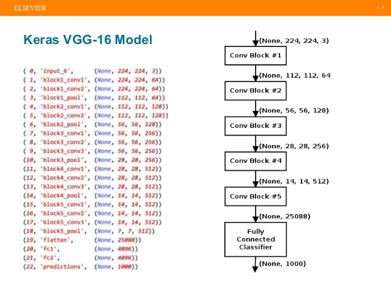
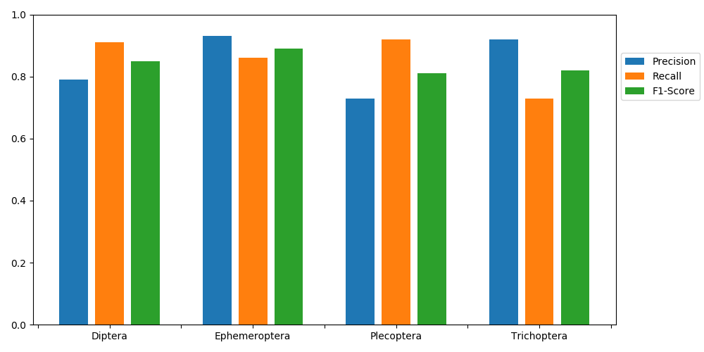
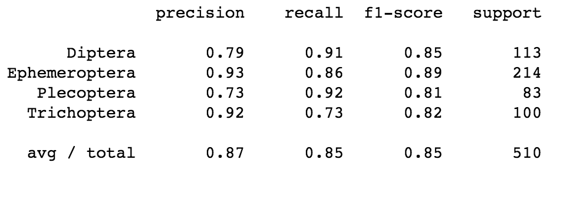
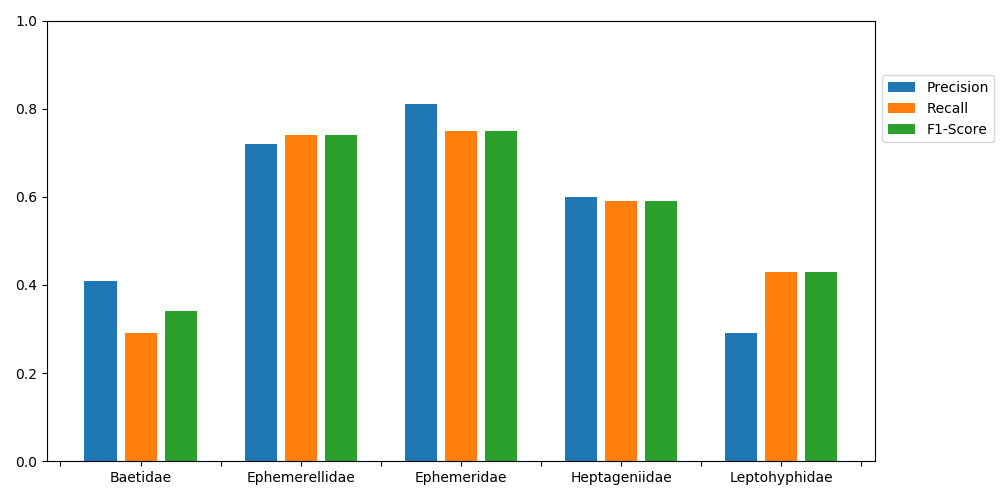
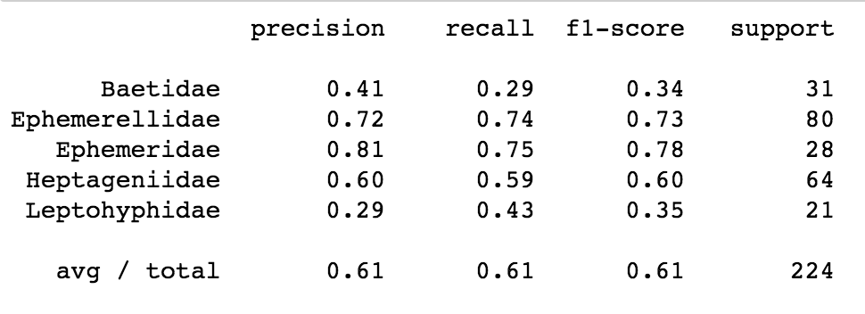

# Benthic Macroinvertebrate Identification

The Cean Water Act requires each state to monitor their rivers, streams, and other water resources for both point sources and non-point sources of pollution. This requirement makes for a unique challenge, since this monitoring has the potential to be both expensive and time consuming.

An alternative to chemical testing is the use of bioassessment. This is a method that uses existing aquatic organisms as a measure of the health of the system. Of the organisms used for this process, benthic macroinvertebrates are the most useful due to their ease of collection and identification, sensitivity to environmental change, and the wide variety of different taxa represented in the group. 

    

With biological assessment, we can utilize existing stream biota to gauge the health of a stream. This offers a number of advantages over traditional methods of water quality assessment. In the framework of the Clean Water Act, it makes the water assessments more accessible and meaningful. The biological integrity of a stream system is easier to understand than the stream’s chemical makeup. Furthermore, the stream ecosystem is a more integrated metric of total watershed health. Stream biota will respond to physical stresses, such as perturbations in temperature, stream flow, mixing, or habitat variety, as well as chemical or biological stresses. Aquatic communities integrate the conditions of a watershed, from the tributaries through the main stream (Barbour, 1999).

There are some species of benthic macroinvertebrates that are very good indicators of pollution levels. If the organism is relatively large and does not develop a respiratory system, then it will require a constant flow of well oxygenated water in order to survive. This includes certain Trichoptera and Plecoptera larvae which lack gills. As pollution tends to lead to decreased dissolved oxygen content (DOC), this means that these groups are likely to see population decreases first as DOC falls. Conversely, there are groups that have adaptations to low oxygen environments. This includes certain Chironomidae, Notonectidae, and Oligochaeta which have a respiratory pigment which increases the efficiency of oxygen absorption (Alba-Tercedor, 2006). As DOC falls, we would expect to see the relative proportion of these organisms increase.  

# Biologic Metrics  

A biological metric is a way of quantifying the results of a biological survey of a stream.  They attempt to quantify the integrity of the biological community, ideally taking into account the taxonomic structure and function in such a way as to indicate ambient water quality.  This has been used as a means of measuring water quality since Kolwitz and Marsson authored a paper quantifying the relationship between aquatic organisms and the purity or pollution of water in 1902. The method they outlined, the saprobic approach, involved observing particular pollution sensitive organisms and noting their responses, and it is still in limited use today.  One such metric is biological diversity. This incorporates three different components of community structure: richness, evenness, and abundance. Richness is the number of species present, evenness is a measure of how uniformly the individuals are distributed among species, and abundance is the total number of organisms present. The most common diversity index is the Shannon-Wiener index:

  

Where H’ is the diversity index value, Ni is the number of individuals belonging to species i, and N is the total number of specimen collected (Metcalfe-Smith, 1994). This has the advantages of being a strictly quantitative number, which lends itself to statistical representation, and no assumptions are made about the relative tolerances of individual species – such tolerances being sometimes questionable, and capable of variation among regions.

# CNNs to Identify Benthic Macroinvertebrates

  
 Plecoptera collected from the Boulder Creek   

To calculate a metric such as the Shannon-Wiener Index, we need to identify which benthic macroinvertebrates we've collected. That is easier said than done, however, as it requires a trained eye to pick out the details that distinguish them. It's time consuming to identify each specimen, and for someone with very little experience such as myself, it's difficult to resolve taxonomic detail. 

A tool that could identify benthic macroinvertebrates from images could save time and allow amateurs to participate more readily in the stewardship of our waterways. I wanted to train a model that could accomplish this, and the obvious choice was a convolutional neural network. 

Training a CNN properly requires a staggering number of images. I used the [Requests](http://docs.python-requests.org/en/master/) and [BeautifulSoup](https://www.crummy.com/software/BeautifulSoup/) libraries to scrape 8,500 benthic macroinvertebrate images from the web. I then used a combination of [Scikit-Image](http://scikit-image.org/) and custom code to process the images I had scrapped - culling unuseable images, removing watermarks, and cropping. I also had to pad the images to make them square so that they would not be warped when they were read in by Keras.

 
 VGG-16 Model Architecture  

There's no reason to reinvent the wheel for this sort of project. Training a CNN from scratch would take more images than I had access to, and there are already pre-trained neural networks easily available. The VGG-16 Model is available as a part of the Keras library, and it includes weights that have been trained on ImageNet - hundreds of thousands of images. By removing the fully connected layers at the bottom of the model, I was able to use remaining layers as a feature extractor. I added my own fully connected layers which received a 7 x 7 x 512 tensor - the VGG-16 representation of the data. 

 # Results
 
My results were encouraging. When I looked at the data at the order level, I had precision and recall of about .85, and an f1-score of .85.
 
  
 Between Order Precision, Recall, and F1-Score 

I had more ephemeroptera than any other order of macroinvertebrates. I looked at the 5 families that were most represented in my data, and was able to achieve a precision, recall and f1-score of .61. While this is less encouraging than the order-level results, I had far fewer images per class, and with more images I think that better results would be possible.

 Between Family Precision, Recall, and F1-Score 

# Works Cited

J. Ärje, V et al. "Human Experts Vs. Machines in Taxa Recognition." Statistical Machine Learning. Retrieved from: https://arxiv.org/abs/1708.06899. (2017)

Raitoharju, J. et al. "Data Enrichment in Fine-Grained Classification of Aquatic Macroinvertebrates." 2016 ICPR 2nd Workshop on Computer Vision for Analysis of Underwater Imagery (CVAUI), Cancun, 2016, pp. 43-48. doi: 10.1109/CVAUI.2016.020

S. Kiranyaz, T. Ince, A. Iosifidis and M. Gabbouj, “Progressive Operational Perceptrons”, Neurocomputing (Elsevier), vol. 224, pp. 142-154, Feb. 2017. http://dx.doi.org/10.1016/j.neucom.2016.10.044

Ärje, J. (2016). Improving statistical classification methods and ecological status assessment for river macroinvertebrates. University of Jyväskylä, Department of Mathematics and Statistics, Report 156.

Ärje, J.,  Kärkkäinen, S., Meissner, K.,  Iosifidis, A.,  Ince, T., Gabbouj, M.,  Kiranyaz, S.  (2017) The effect of automated taxa identification errors on biological indices, Expert Systems with Applications, Volume 72, 15 April 2017, Pages 108-120, ISSN 0957-4174.https://doi.org/10.1016/j.eswa.2016.12.015

Ärje, J., Divino, F., Choi, K-P, Meissner, K. and S. Kärkkäinen (2016):Understanding the Statistical Properties of the Percent Model Affinity Index Can Improve Biomonitoring Related Decision Making. Stochastic Environmental Research and Risk Assessment 2016; 30 (7): 1981-2008.

Alba-Tercedor, J. “Aquatic Macroinvertebrates.” Biological Monitoring of Rivers: Applications and Perspectives. John Wiley and Sons, Ltd., West Sussex, pp. 71-87. (2006).

Barbour, M., Gerritsen, J., Snyder, B., et al. Rapid Bioassessment Protocols for Use in Streams and Wadable Rivers: Periphyton, Benthic Macroinvertebrates and Fish, Second Edition. US Environmental Protection Agency. (1999). 

Metcalfe-Smith, J. L. “Biological Water-Quality Assessment of Rivers: Use of Macroinvertebrate Communities.” The Rivers Handbook: Hydrologic and Ecological Principles, Volume II. Blackwell Scientific Publications, London, pp. 144-170. (1994).
